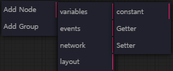
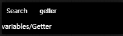

import panelVid from '../img/control_panel.mp4'

# Edit Fabrica

`LITEGRAPH` 패널은 `Fabrica` 파일 관리, 사용 중인 `Variables`과 `Teleport Node` 그리고 선택된 **[Node](../../nodes)** 정보들을 확인할 수 있는 탭들로 구성되어 있습니다.

`Fabrica` 파일을 클릭하면 좌측 상단 `Widget`과 `Canvas`로 구성된 패널이 열립니다.

## Widget

플레이 버튼을 클릭하면 `Fabrica`의 `runStep` 함수를 실행시킵니다.  
이 함수는 `Fabrica` 안에 있는 `Node`들의 `onExecute` 함수를 실행시킵니다. 

`onExecute` 실행 순서는 `Node`들의 Input Slot의 연결상태로 결정됩니다.

저장버튼을 클릭하면 `Fabrica`가 저장됩니다.

:::note
Connected Input Slot이 없는 `Node`는 level = 0 으로 간주됩니다. 그리고 level = 0인 `Node`가 Input Slot에 연결되있는 `Node`는 level = 1 으로 간주됩니다. 이런식으로 `Node`의 level과 실행 순서가 정해집니다. 
:::

## Canvas

`Canvas`는 `Node`의 시각적 형태와 상호작용을 표현합니다.  

`Node` 추가는 마우스 오른쪽 클릭 또는 더블클릭을 통해 할 수 있습니다. 

   

### Shortcuts

- space: space key 누른상태로 마우스 커서를 이동하면 canvas가 이동.
- Ctrl + Drag: 여러개의 `Node`들을 선택.
- Ctrl + A: 모든 `Node`들을 선택. 
- Ctrl + C/Ctrl + V: 선택된 `Node`를 복사 및 붙여넣기.

## Litegraph Panel

### List

**`Fabrica`** 파일을 생성하거나 삭제 및 이름 변경을 할 수 있는 탭입니다.

### Variables

**`Node(variables/Setter)`** 를 통해 저장된 변수들을 보여주는 탭입니다.

### EventTeleports

**`Node(events/Teleport[in])`** 의 위치를 보여주는 탭입니다.

### Details

**`선택된 Node`** 의 설정 및 값을 확인 또는 편집할 수 있는 탭입니다.

<video controls>
  <source src={panelVid}/>
</video>