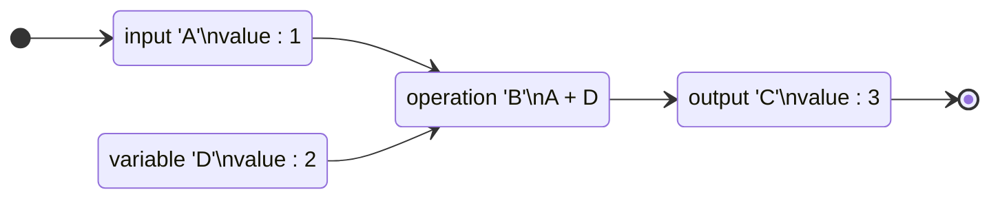
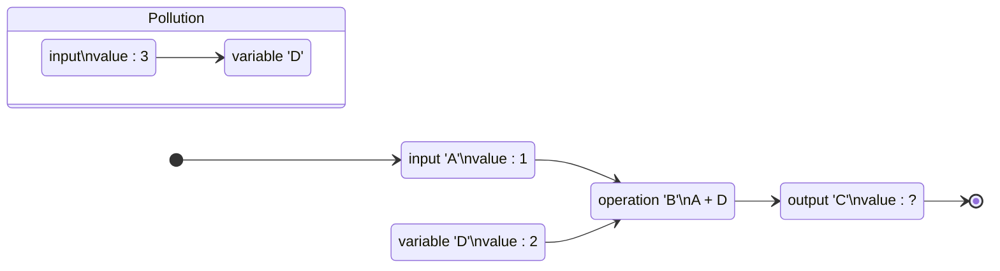

# ImPure Class Node

Events flow 기반 **`ImPure`** 클래스로 확장된 `Node`

## ImPure란?

**`ImPure Node`**를 개발하기 앞서 **`ImPure`**에 대해 먼저 알아봅니다.

프로그래밍에서 **`ImPure Function`**은 side Effects를 발생시켜 Fabrica에 있는 모든 노드 또는 흐름에 영향을 줍니다.

<!-- 흐름에 대한 분기를 만들고 제어합니다. -->

<br/>

아래 `Flowchart`는 ImPure Function의 흐름을 그린 것입니다.

### Without Pollution

Impure Function은 Side-Effects가 발동되지 않으면 마치 [Pure Function](./Pure.md)처럼 동작합니다.



<br/>

1. `입력 A`는 값 1을 가지고 있습니다.<br/>
1. `변수 D`의 초기값은 2를 가지고 있습니다.<br/>
1. `연산 B`는 `입력 A[1]` + `변수 D[2]`를 합니다.<br/>
1. `결과 C`는 `연산 B`의 결과값 3이 도출됩니다.

<br/>

### With Pollution (Side-Effects)

Impure Function은 Side-Effects가 생기거나 영향을 받는다면 그 결과 값은 예상과 달라질 수 있습니다.



<br/>

1. `입력 A`는 값 1을 가지고 있습니다.<br/>
1. `변수 D`의 초기값은 2를 가지고 있습니다.<br/>
1. `Pollution`은 4번을 수행하기 전 또는 수행한 후 `변수 D`의 값을 3으로 바꿉니다.<br/>
1. `연산 B`는 `입력 A[1]` + `변수 D[2]`를 합니다.<br/>
1. `결과 C`는 `연산 B`의 결과값 3 또는 4가 도출됩니다.

<br/>

이 흐름에서 주목할만한 점은 `변수 D`가 Side-Effect를 일으켜 결과값이 예상하지 못한 값으로 도출된다는 점입니다.

## ImPure Node

ImPure Node의 구성

### Exection Event Slot

### Data Slot

<!-- ## Flow in Fabrica -->

## 시작하기

이제부터 **`ImPure Node`**의 개발에 대해 설명합니다.

### Result Code

```js
import { ImPure } from "@design-express/fabrica";

let D = 2;

export class PollutionNode extends ImPure {
  static path = "test";
  static title = "PollutionNode";
  static description = "";

  constructor() {
    super();
  }

  onExecute() {
    D = 3;
    return;
  }
}

export class ImPureNode extends ImPure {
  static path = "test";
  static title = "PureNode";
  static description = "";

  constructor() {
    super();
    this.addInput("A", "number");
    this.addOutput("C", "number");
  }

  onExecute() {
    const inputA = this.getInputData(1);
    const outputC = inputA + D;
    this.setoutputData(1, outputC);
    return;
  }
}
```

<!-- :::info
`Flowchart`는 `Node` 연결과는 상관이 없는 단순한 코드 실행 흐름을 표현한 것 입니다.
::: -->
<!--
```javascript
function B(A) {
  return A + 2;
}
let A = 1;
let C = B(A);
``` -->
