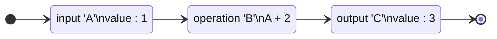

# Pure Class Node

Execution flow 기반 **`Pure`** 클래스로 확장된 `Node`

## Pure란?

**`Pure Node`**를 개발하기 앞서 **`Pure`**에 대해 먼저 알아봅니다.

프로그래밍에서 **`Pure Function`**은 어떠한 side Effects를 발생시키지 않고 결과 값을 도출합니다.

<br/>

아래 `Flowchart`는 Pure Function의 흐름을 그린 것입니다.



<br/>

1. `입력 A`는 값 1을 가지고 있습니다.<br/>
1. `연산 B`는 `입력 A`에 2를 더합니다.<br/>
1. `결과 C`는 `연산 B`의 결과값 3이 도출됩니다.

<br/>

이 흐름에서 주목할만한 점은 **[ImPure Node](./ImPure.md)**와는 다르게 `입력 A`가 변하지 않는 한 `결과 C`는 항상 결과값 3이 나올 것 입니다.


<!-- ## Flow in Fabrica -->

## 시작하기

이제부터 **`Pure Node`**의 개발에 대해 설명합니다.

### Import package
```js
import { Pure } from "@design-express/fabrica";
...
```

### Make Frame
```js 
...
export class PureNode extends Pure {
  static path = "test";
  static title = "PureNode";
  static description = "";

  constructor() {
    super();
  }

  onExecute() {
  }
}
...
```

### Result Code

```js
import { Pure } from "@design-express/fabrica";

export class PureNode extends Pure {
  static path = "test";
  static title = "PureNode";
  static description = "";

  constructor() {
    super();
    this.addInput("A", "number");
    this.addOutput("C", "number");
  }

  onExecute() {
    const inputA = this.getInputData(1);
    const outputC = inputA + 2;
    this.setoutputData(1, outputC);
    return;
  }
}
```

<!-- :::info
`Flowchart`는 `Node` 연결과는 상관이 없는 단순한 코드 실행 흐름을 표현한 것 입니다.
::: -->
<!--
```javascript
function B(A) {
  return A + 2;
}
let A = 1;
let C = B(A);
``` -->
