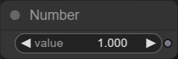

import DocCardList from '@theme/DocCardList';
import connectNodesVid from './img/connect_nodes.mp4'

# Introduce Nodes

## What is?


**`Nodes`**는 Design Express의 [Visual Programming](https://wikipedia.org/wiki/Visual_programming_language)툴인 **[Fabrica Editor](/design)**에서 사용하는 노드의 집합 패키지입니다.

## Who make?

필요한 기능의 `Nodes`를 [Fabrica Editor](/design)를 다뤄본 **누구나** 만들 수 있습니다.

`Nodes`를 개발하고 이해하기에 앞서 여러분은 `Javascript` 언어에 대한 지식이 필요합니다.<br/>
하지만 `Javascript`를 모른다고 두려워 할 필요는 없습니다.

그 무엇보다 만들기 쉬울 것 입니다.

## Quick Started

### 1. What you'll need

- [Node.js](https://nodejs.org/en/download/) version 14 또는 그 이상
- 선호하는 개발 에디터
- Command Prompt, Powershell, Terminal 또는 코드 편집기의 통합 터미널
  <!-- - 이 문서에서는 **[VSCode](https://code.visualstudio.com/)** 기준으로 설명합니다. -->

### 2. Generate a new Nodes

아래의 명령어는 자동으로 `Nodes` 개발 환경을 구축합니다.<br/>

```bash
npx @design-express/create-node my-first-nodes
```

:::tip
`"my-first-nodes"`는 원하는 Nodes 프로젝트 명으로 수정할 수 있습니다.
:::

### 3. Ready to connect

아래의 명령어를 통해 개발할 노드를 실시간으로 실행하기 위해 `Nodes` 를 Design Express의 [Fabrica Editor](/design)에 연결할 수 있도록 준비 합니다.

```bash
npm start
```

### 4. Connect to Editor

이제 Nodes의 개발 준비가 거의 끝났습니다.<br/>
다음은 실행하고 테스트하기 위한 단계입니다.

- [Design Express - Fabrica 에디터](https://x.nexivil.com/editor/dashboard)에 들어갑니다.
- 우측 상단 `Nodes` 버튼을 클릭하고 위젯 상단 `Nodes` 드롭 다운 메뉴를 클릭 합니다.
- `Develop` 메뉴를 클릭후 Nodes 개발 익스텐션을 설치 합니다.
- textbox에 `@user/my-first-nodes:3000`를 입력하고 확인을 클릭합니다.

:::note
`"my-first-nodes"`는 위에서 작성한 Nodes 프로젝트 명입니다.
:::

<video controls>
  <source src={connectNodesVid}/>
</video>

### 5. Play with Nodes

이제 Nodes를 개발할 모든 준비는 끝났습니다.<br/>
[Fabrica Editor](/design)를 통해 Nodes를 실행하고 개발 해보시기 바랍니다.

## Example Nodes
<!-- 
Get started by **creating a new site**.

Or **try Docusaurus immediately** with **[docusaurus.new](https://docusaurus.new)**. -->
