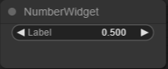
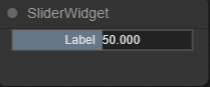
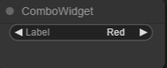
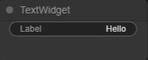
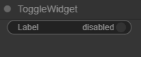

# Widget

`Design editor`에서 `Node` 컨트롤의 편의성을 위해 여러가지 `widget`을 추가할 수 있습니다.

Type은 `slider`, `number`, `combo`, `buttton`, `text`, `toggle` 총 6가지가 있으며, 공통적인 작성 방식은 아래와 같습니다.

```js
...
this.addwidget(type: String, label: String, defaultValue: Any, callback: Function, options: Object)
...
```

## number



```js
...
export class number {
    static path = "example";
    static title = "NumberWidget";
    static description = "please describe your node";

    constructor() {
        this.properties = { value: 0 };
        let nodeProps = this.properties;
        // add widget in node
        this.addWidget("number", "Label", 0.5, function (v) {nodeProps.value = v}, { min: 0, max: 10 });
    }

    onExecute() {
        // executing code...
    }
}
...
```

<br/>

## slider



```js
...
export class slider {
    static path = "example";
    static title = "SliderWidget";
    static description = "please describe your node";

    constructor() {
        this.properties = { value: 0.5 };
        let nodeProps = this.properties;
        // add widget in node
        this.addWidget( "slider", "Label", 50, function (v) {nodeProps.value = v; }, { min: 0, max: 100 });
    }

    onExecute() {
        // executing code...
    }
}
...
```

<br/>

## combo



```js
...
export class combo {
    static path = "example";
    static title = "ComboWidget";
    static description = "please describe your node";

    constructor() {
        this.properties = { value: "Red" };
        let nodeProps = this.properties;
        // add widget in node
        this.addWidget("combo", "Label", "Red", function (v) {nodeProps.value = v}, { values: ["Red", "Blue", "Green"] });
    }

    onExecute() {
        // executing code...
    }
}
...
```

<br/>

## text



```js
...
export class text {
    static path = "example";
    static title = "TextWidget";
    static description = "please describe your node";

    constructor() {
        this.properties = { value: "Hello" };
        let nodeProps = this.properties;
        // add widget in node
        this.addWidget("text", "Label", "Hello", function (v) {nodeProps.value = v}, {});
    }

    onExecute() {
        // executing code...
    }
}
...
```

<br/>

## toggle



```js
...
export class toggle {
    static path = "example";
    static title = "ToggleWidget";
    static description = "please describe your node";

    constructor() {
        this.properties = { value: true };
        let nodeProps = this.properties;
        // add widget in node
        this.addWidget("toggle", "Label", true, function (v) {nodeProps.value = v}, { on: "enabled", off: "disabled" });
    }

    onExecute() {
        // executing code...
    }
}
...
```


